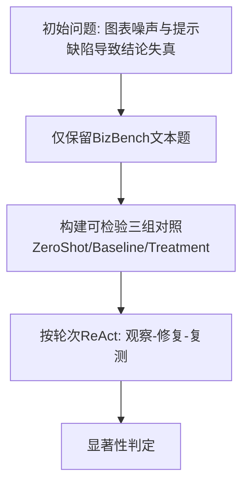
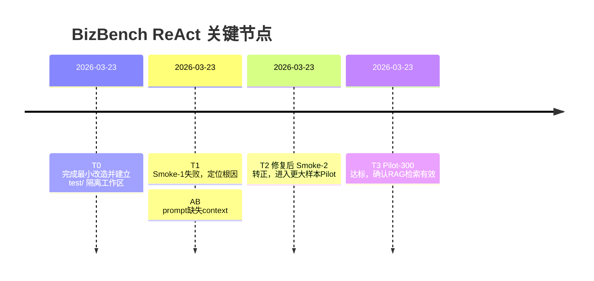
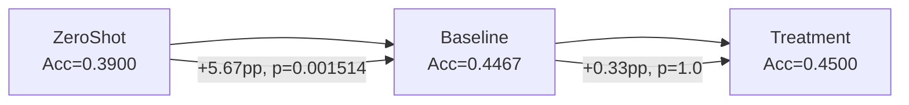

# ReAct 进展总览（BizBench 文本推理）

## 1) 实验定义（固定口径）
```mermaid
flowchart LR
  Z[ZeroShot\n仅Target: Question+Context(+Options)] --> E
  B[Baseline\n检索示例: Q+Context+Gold Answer] --> E
  T[Treatment\n检索示例: Q+Context+Gold Answer+Trajectory] --> E
  E[同一Target集合\n同一seed\n同一评测器]
```

- `ΔRAG = Acc(Baseline) - Acc(ZeroShot)`
- `ΔTraj = Acc(Treatment) - Acc(Baseline)`
- 达标标准（用户确认）：`ΔRAG >= 2.0pp` 且 `sign-test p < 0.05`

## 2) 方法与关键修改点（高内聚、低耦合）


- `step1_generate_trajectories.py`：新增 `--dataset-name`，支持按 `source` 过滤，仅跑 `bizbench`。
- `prepare_ab_test_data.py`：数据集无关化（`finmmr/bizbench`）、支持 `--test-file`、`--labels-path`、`--only-success-trajectory`、泄漏过滤（question/question+answer）。
- `run_qwen_ab_test.py`：新增 `zeroshot/all` 模式、符号检验统计；并修复 prompt（示例与目标都注入 `context`，按 `answer_type` 约束输出）。

## 3) 里程碑（仅记录关键节点）


## 4) 结果摘要（当前有效结论）


- `baseline_vs_zeroshot`：`0.3900 -> 0.4467`，`ΔRAG=+5.67pp`，`p=0.001514`，**达标**。
- `treatment_vs_baseline`：`0.4467 -> 0.4500`，`ΔTraj=+0.33pp`，`p=1.0`，未显著。

## 5) 结论（当前冻结）
- 在 BizBench 文本场景下，**RAG检索示例**对小模型题目逻辑推理具有显著正向作用（已达标）。
- **轨迹文本增益**目前仅轻微提升且不显著，后续按单因子 ReAct 继续优化（等待用户下一步指示）。
